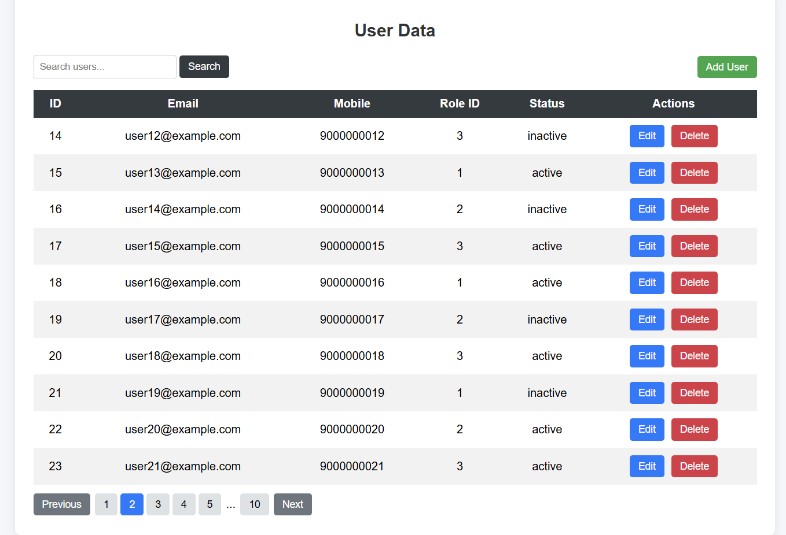
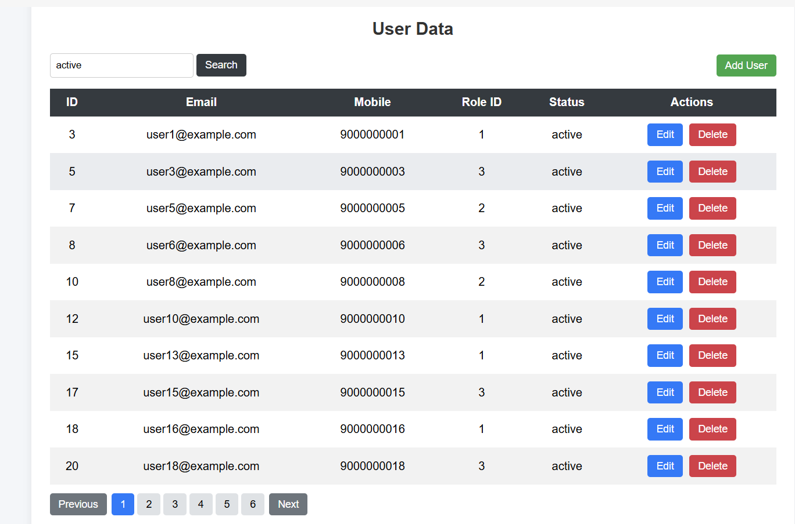
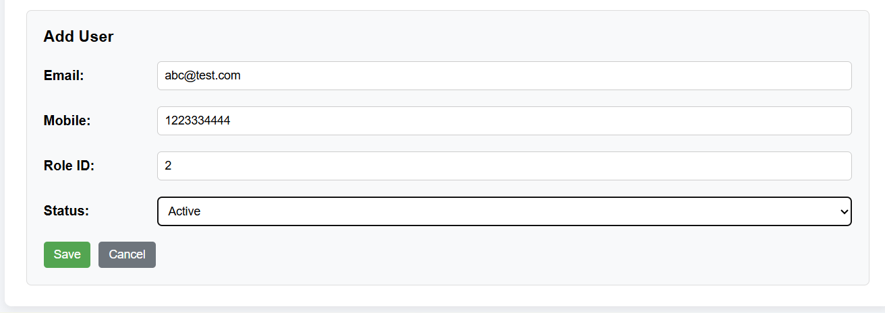
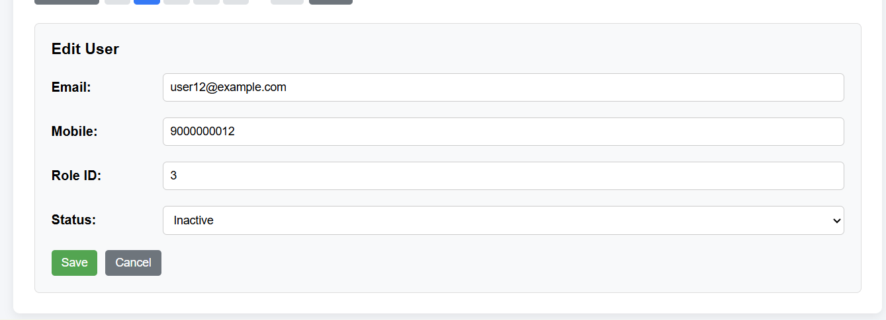

# Flask User Management System

A full-stack web module that reads user data from a database via an API and displays it on a webpage with **Search, Pagination, and CRUD (Create, Read, Update, Delete)** operations. The project is built using **Flask, MySQL, HTML, CSS, and JavaScript**, and deployed using **Render** and **Railway**.

## Live Application
https://flask-user-management-system.onrender.com

## GitHub Repository
https://github.com/monis-iqbal-io/flask-user-management-system

## Features
- Display users in a dynamic table
- Pagination without page reload
- Search across Email, Mobile, Role ID, and Status
- Add new users
- Edit existing users
- Delete users
- Frontend and backend validation
- Smooth scrolling to form for Add/Edit
- Clean and structured UI

## Screenshots

### Table View


### Search Functionality


### Add User Form


### Edit User Form


## Tech Stack
Backend:
- Python
- Flask

Database:
- MySQL (Railway)

Frontend:
- HTML
- CSS
- JavaScript

Deployment:
- Render (Application hosting)
- Railway (Database hosting)

## Database Structure

Table: **users**

| Field | Description |
|------|-------------|
| id | Primary key |
| email | User email |
| mobile | Mobile number |
| role_id | Role identifier |
| status | active / inactive |

## API Endpoints

### Fetch Users
GET /api/users?page=1&limit=10&search=text

Returns paginated user data.

Example response:

```json
{
  "total_records": 100,
  "total_pages": 10,
  "current_page": 1,
  "data": [
    {
      "id": 1,
      "email": "user@example.com",
      "mobile": "9876543210",
      "role_id": 1,
      "status": "active"
    }
  ]
}
```

### Add User
POST /api/users

### Update User
PUT /api/users/<id>

### Delete User
DELETE /api/users/<id>

## Validation Implemented

Frontend:
- Email format validation
- Mobile number restricted to **10 digits**
- Role ID restricted between **1–3**
- Status dropdown (**active / inactive**)

Backend:
- Server-side validation to ensure data integrity
- Returns proper **HTTP 400 responses** for invalid input

## Project Structure

flask-user-management-system  
│  
├── app.py  
├── requirements.txt  
├── Procfile  
│  
├── templates  
│   └── index.html  
│  
├── static  
│   ├── script.js  
│   └── style.css  
│  
├── screenshots  
│   ├── table-view.png  
│   ├── search.png  
│   ├── add-user-form.png  
│   └── edit-user-form.png  
│  
└── README.md  

## Running the Project Locally

Clone the repository:

```
git clone https://github.com/monis-iqbal-io/flask-user-management-system.git
```

Navigate to the project folder:

```
cd flask-user-management-system
```

Create a virtual environment:

```
python -m venv venv
```

Activate the environment (Windows):

```
venv\Scripts\activate
```

Install dependencies:

```
pip install -r requirements.txt
```

Run the application:

```
python app.py
```

Open in browser:

```
http://localhost:5000
```

## Author

Monis Iqbal